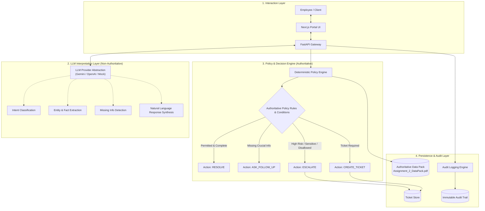
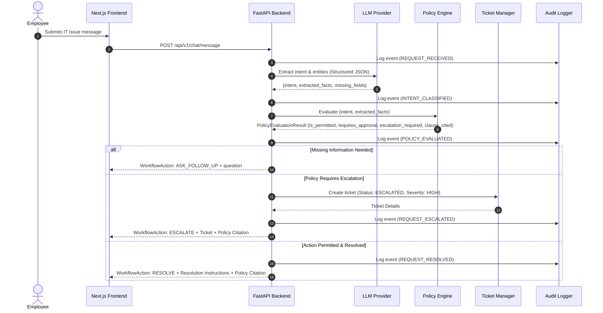

# Veridian Assist — Technical Architecture Specification

## 1. Executive Overview

**Veridian Assist** is an enterprise-grade internal IT service agent designed for **Veridian Corp**. The system processes natural language IT service requests from employees, deterministically evaluates compliance against authoritative company policies, asks targeted follow-up questions when critical parameters are missing, resolves authorized requests, escalates risky or out-of-policy actions, generates structured tracking tickets, displays authoritative citations, and maintains an immutable audit trail.

---

## 2. Core Architectural Principle: Decoupling LLM from Policy Authority

> [!IMPORTANT]
> **Fundamental Principle**: The Large Language Model (LLM) is **NOT** the final authority for company policy, permissions, approval workflows, or escalation determinations. 

The architecture strictly separates responsibilities into four distinct layers:

### Layer Separation Breakdown

| Component | Responsibility | Authoritative? |
| :--- | :--- | :---: |
| **LLM Interpretation** | Parsing natural language, identifying semantic intent, extracting parameters, detecting missing context, phrasing conversational explanations. | ❌ No |
| **Policy & Decision Engine** | Matching authoritative rules, validating constraints, evaluating permissions, enforcing approval workflows, deciding mandatory escalations. | ✅ Yes |
| **Workflow Engine** | Executing deterministic lifecycle actions: `ASK_FOLLOW_UP`, `RESOLVE`, `ESCALATE`, `CREATE_TICKET`. | ✅ Yes |
| **Audit & Persistence** | Recording immutable events, logging citations, maintaining ticket state, securing policy documents. | ✅ Yes |

---

## 3. High-Level System Architecture

---

## 4. Authoritative Knowledge Layer (Data Pack)

The single source of truth for Veridian Corp is:
`data/source/Assignment_2_DataPack.pdf`

* **Preservation Policy**: The raw PDF is preserved byte-for-byte (`SHA256: 21A5ED364EF5063F10B73E349DA3665270C1DB3FE51F85BE91F8E3E347805C50`).
* **Zero Synthetic Inventions**: No company policies, SLAs, or escalation rules are fabricated. Everything is derived solely from the Data Pack.
* **Citation Guarantee**: Every resolution, follow-up, or escalation links back to an exact policy identifier and clause extract.

---

## 5. Pluggable LLM Provider Abstraction

To ensure vendor independence and avoid lock-in, the backend implements `BaseLLMProvider`:
- **`MockLLMProvider`**: Zero-cost, deterministic testing and CI validation without network dependencies.
- **`GeminiProvider`**: Primary enterprise implementation leveraging Google Gemini models via `GEMINI_API_KEY`.
- **`OpenAIProvider`**: Alternative enterprise implementation leveraging OpenAI models via `OPENAI_API_KEY`.

All API credentials are exclusively loaded from environment variables (`.env`) and never committed to source control.

---

## 6. Deterministic Workflow Actions

The system defines four authoritative actions:
1. **`ASK_FOLLOW_UP`**: Triggered when mandatory parameters (e.g. employee ID, asset tag, software name) are absent from the request.
2. **`RESOLVE`**: Triggered when the request falls within authorized self-service or standard procedures and passes all policy checks.
3. **`ESCALATE`**: Triggered when a request involves high-risk actions (e.g. admin privilege requests, unauthorized hardware, security policy exceptions) or unclear requests.
4. **`CREATE_TICKET`**: Triggered automatically when an escalation occurs or when work requires human IT support staff fulfillment.

---

## 7. Auditability & Compliance

Every request, policy lookup, decision, and status transition is recorded in an append-only audit trail:
- **Timestamp (UTC)**
- **Session & Employee ID**
- **Actor** (`USER`, `AGENT`, `POLICY_ENGINE`, `IT_ADMIN`)
- **Event Type** (`REQUEST_RECEIVED`, `INTENT_CLASSIFIED`, `POLICY_EVALUATED`, `FOLLOW_UP_REQUESTED`, `REQUEST_RESOLVED`, `REQUEST_ESCALATED`, `TICKET_CREATED`)
- **Policy Citation** (Authoritative clause reference)
- **Contextual Payload**
